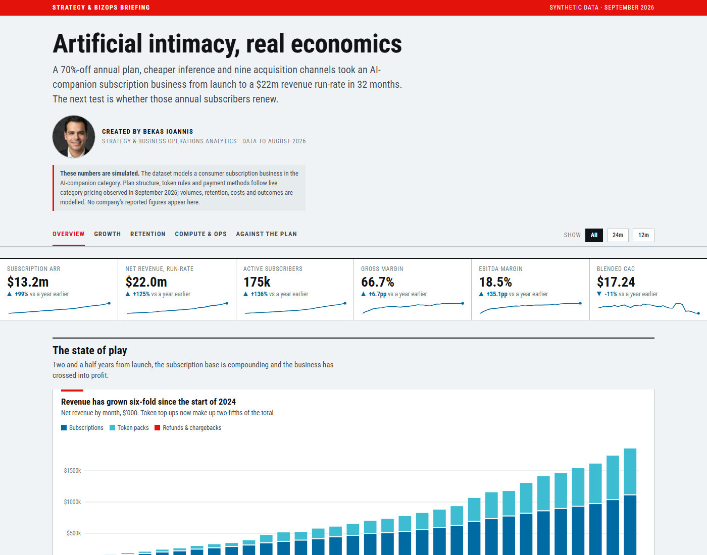

# Subscription BizOps dataset and briefing dashboard

_Created by BEKAS Ioannis — a strategy & business-operations portfolio piece._

A synthetic strategy-and-operations dataset for a consumer AI-companion subscription business, and an
Economist-style dashboard built on top of it. Everything is generated from a seeded simulation: **no real
company's figures appear here.**



## What this is

| | |
|---|---|
| **Dashboard** | One page, 19 charts, hand-drawn SVG — no chart library, no CDN. Open `index.html`. |
| **Dataset** | 35 linked tables, ~815k rows: subscriber-level records, daily revenue, cohorts, marketing, compute cost, support tickets, P&L with budget and forecast. |
| **Period** | Actuals Jan 2024 – Aug 2026, FY2025 and FY2026 budgets, a Sep–Dec 2026 forecast. USD, net of VAT. |
| **Scale** | 362k paying subscribers, 1.05m billing transactions, $13.2m subscription ARR at Aug 2026. |

Taken from live category pricing (observed September 2026): the 1/3/12-month plans at 13.99 / 8.99 /
3.99 a month, 100 included tokens, token top-ups, what tokens are spent on, card and crypto payment
methods, and a localised French site. Everything else — traffic, conversion, retention, costs, processors,
budgets, experiments — is modelled.

## Run it

```bash
python -m http.server 8000     # then open http://localhost:8000
```

`index.html` also opens straight from disk: the data ships as `data/dashboard.js` as well as
`data/dashboard.json`, so no server is needed.

## Regenerate

```bash
pip install numpy pandas xlsxwriter
python dataset/generator/build.py --export   # rebuild all 35 tables -> dataset/csv + .xlsx
python tools/build_dashboard_data.py         # aggregate them -> data/dashboard.json + .js
```

The simulation is seeded (`SEED = 42`), so a rebuild reproduces the same figures. `build.py` prints a
reconciliation report: the MRR bridge closes to the cent, subscriber counts match the marketing and
funnel tables, GPU cluster cost equals usage cost, and every refund has a matching support ticket.

## Layout

```
index.html              the dashboard
assets/                 economist.css, charts.js (SVG toolkit), dashboard.js (page)
data/                   dashboard.json + dashboard.js (aggregates, ~75 KB)
tools/                  build_dashboard_data.py
dataset/
  Subscription_BizOps_Dataset.xlsx  37 sheets: data, dictionary, live P&L and budget-vs-actual views
  csv/                           the 35 tables + data dictionary
  generator/                     the simulation (config, simulate, marts, finance, export)
  README.md                      dataset documentation
```

Three tables are too large for this repository and are rebuilt by `build.py`:
`fact_subscribers.csv`, `fact_revenue_daily.csv` and `fact_support_tickets.csv`.

## Notes on the charts

Colours are The Economist's chart palette (blue `#006BA2`, red `#E3120B`, cyan `#3EBCD2`, yellow
`#DBA400`), checked for colour-blind separation and contrast before use; the low-contrast pair carries
direct labels, tooltips and a "show the data" table on every chart. House rules followed throughout:
horizontal gridlines only, a black zero line, direct labels instead of legends where they fit, and no
dual axes — two measures on different scales get two charts.

## Licence

MIT — see [LICENSE](LICENSE).
